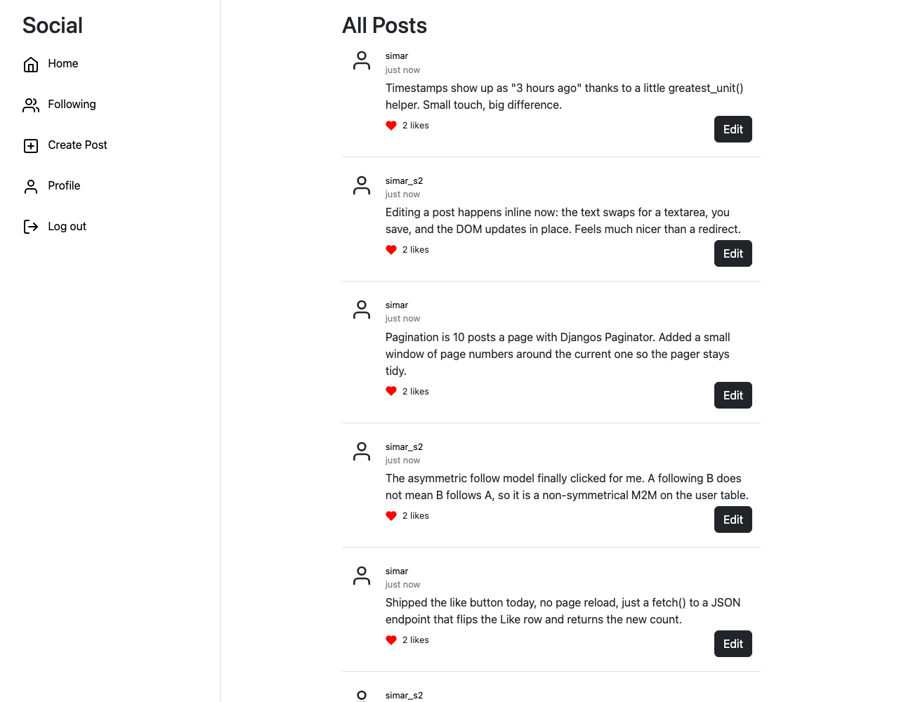

# Network

A small social network, think a stripped-down Twitter, built with Django. Users
can post, follow each other, like posts, and edit their own posts inline. This is
my solution to **CS50W Project 4: Network**.



## Quickstart

```bash
git clone https://github.com/simar-s2/Network.git
cd Network

python -m venv venv
source venv/bin/activate          # Windows: venv\Scripts\activate
pip install django

python manage.py migrate
python manage.py runserver
```

Open http://127.0.0.1:8000. Register an account from the UI to start posting.

## How it works

The app is a fairly standard Django project (`project4/` holds settings, the
`network/` app holds everything else), with a thin layer of vanilla JavaScript for
the interactions that shouldn't reload the page.

**Data model** (`network/models.py`)

| Model  | Purpose |
|--------|---------|
| `User` | Extends Django's `AbstractUser`. Adds a self-referential, **non-symmetrical** `followers` many-to-many field, so "A follows B" does not imply "B follows A". |
| `Post` | Text content, author, timestamp, and a denormalised `likes_count`. |
| `Like` | One row per (user, post) pair, the source of truth for whether the like button is filled in. |

**Request flow**

- **Server-rendered pages.** The feed, profile pages, and the "following" feed are
  plain Django views that query the ORM, run the posts through a `greatest_unit()`
  helper that turns timestamps into "3 hours ago" strings, paginate them 10 at a
  time with Django's `Paginator`, and render a template.
- **AJAX endpoints.** Liking a post (`/like_post/<id>`) and editing a post
  (`/edit_post/<id>`) are hit with `fetch()` from
  `network/static/network/app.js`. They return JSON, and the DOM is updated in
  place so the feed doesn't jump.
- **Follow/unfollow** (`/follow/<username>`) toggles the relationship and redirects
  back to the profile, which recomputes follower/following counts on each load.

Pagination links are constrained to a small window around the current page
(`page_numbers` in the views) so the pager stays compact on large feeds.

## What it does

- Register, log in, log out (Django's auth system)
- Create a text post from the global feed
- **All Posts** feed and a **Following** feed, both paginated
- Profile pages with follower / following counts and a follow button
- Like / unlike any post without a page reload
- Edit your own posts inline

## Built with

Django · SQLite · vanilla JavaScript (`fetch`) · Bootstrap

## License

Released under the [MIT License](LICENSE).
